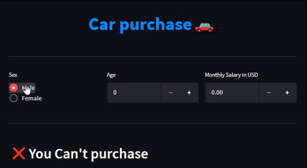

# Cars purchase decision

## Content
StreamLit web application for deciding whether or not to buy a car.

## Dataset
Kaggle dataset: [Cars - Purchase Decision Dataset](https://www.kaggle.com/datasets/gabrielsantello/cars-purchase-decision-dataset)

## Variables
* `Gender`: Gender of buyer
* `Age`: Age of buyer
* `AnnualSalary`: Annual Salary
* `Purchased`: Purchase decision:
    * `0`: No
    * `1`: Yes

---
## WebApp usage
1. Download repository
2. Install `requirements.txt`
3. Execute this command:
    ```bash
    streamlit run carPurchase.py
    ```

